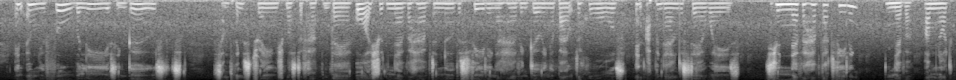
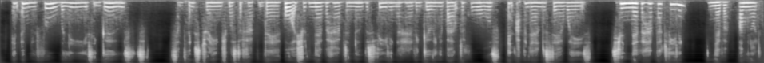

# Denoising

The DL model for spectrogram denoising. Here are examples of noisy and denoised spectrograms. 





### Load data 

Data for training and validation have to be loaded from: 

[train data]:https://drive.google.com/file/d/1jVeoX3yNGL3IqycQKwLb8Hs2N49Advuu/view

[validation data]:https://drive.google.com/file/d/1c8a9xlgThXiX4_zxAOwXkqcooz_MeSQf/view

Data have to have the following structure: 

\- data \\
\-- train \\
\-\- 
            clean\
                 ...
            noisy\
                 ...
        val\
            clean\
                 ...
            noisy\
                 ...

### Set Ups

To install all dependencies required, run:

```
pip install -r requirements.txt
```

### Train denoising model

To train the model, run:

```
python train_model.py --path-to-dataset=PATH-TO-DATA
```

### Evaluate denoising model

To evaluate the model, run:

```
python evaluate.py --path-to-dataset=PATH-TO-DATA
```

